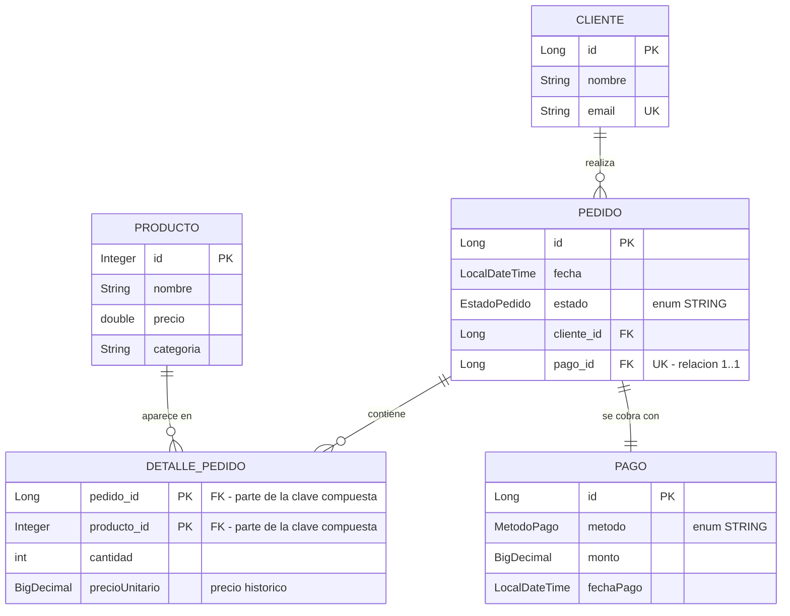
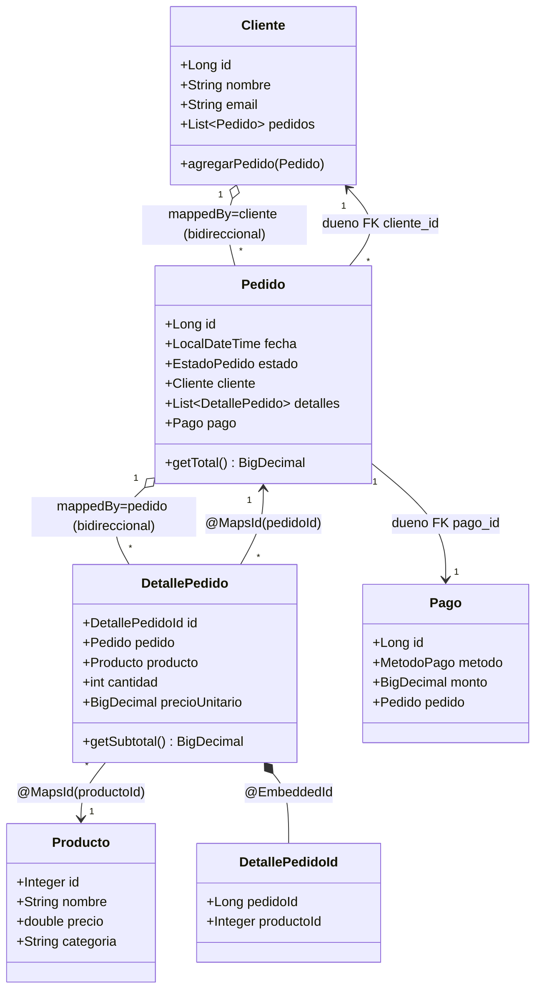

# Modelo de datos - Ventas

Diagrama del modulo de ventas (`com.nh.apirest.model`). Muestra clave compuesta
(`@EmbeddedId` + `@MapsId`), relaciones bidireccionales 1..N y 1..1, y enums
persistidos como texto.

## Diagrama entidad-relacion

## Relaciones de clases (como lo ve JPA)

## Puntos clave que ilustra el modelo

- **Clave compuesta**: `DetallePedido` usa `@EmbeddedId DetallePedidoId`
  (pedido_id + producto_id). Un producto no se repite como linea en el mismo
  pedido.
- **`@MapsId`**: reutiliza las FK (`pedido_id`, `producto_id`) como partes de la
  clave primaria, sin columnas duplicadas.
- **Bidireccional 1..N**: `Cliente` <-> `Pedido` y `Pedido` <-> `DetallePedido`.
  El lado dueno tiene la FK; el inverso usa `mappedBy`. Los helpers
  (`agregarPedido`, `agregarDetalle`) mantienen ambos lados sincronizados.
- **Bidireccional 1..1**: `Pedido` (dueno, FK `pago_id`) <-> `Pago` (`mappedBy`).
- **Tabla de union con atributos**: en vez de `@ManyToMany`, el detalle es una
  entidad porque lleva `cantidad` y `precioUnitario`.
- **Enums como texto**: `EstadoPedido` y `MetodoPago` con
  `@Enumerated(EnumType.STRING)`.
- **`BigDecimal` para dinero**: nunca `double` en montos, por el redondeo.
